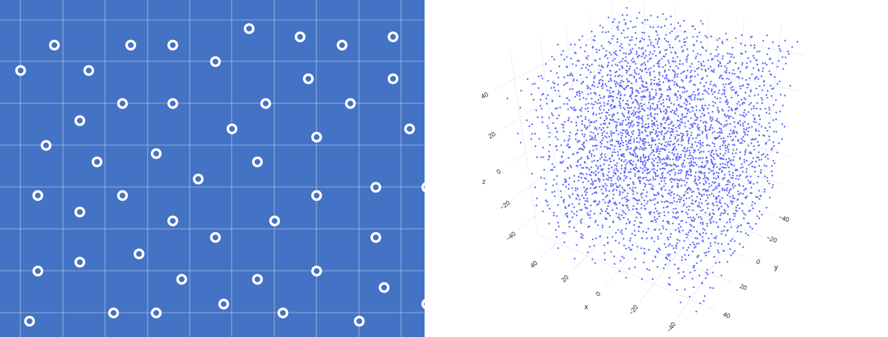

# Poisson Disc Distribution

A simple implementation of the Poisson Disc Distribution in TypeScript that creates a random, uniform distribution of blue noise.

### Complexity analysis

As of now, the algorithm runs in O(n2) complexity time. This is due to the following:

- Every sample will be considered as active at least once and put in the `activeSamples` list, so the initial `while` loop will run O(n) times.
- Checking against the other n - 1 samples for distance sums only happens k times at most. This is executed in a total O(n) complexity time
- Enqueuing / pushing operations are amortized O(1).

Due to the brute-force nature of the algorithm, it's essentially checking every sample against every other sample. One possible improvement would be mapping the samples internally [as explained by Robert Bridson](https://www.cct.lsu.edu/~fharhad/ganbatte/siggraph2007/CD2/content/sketches/0250.pdf) in a grid of size `r / sqrt(n)` to cut down complexity in the second step from O(n - 1) to a constant.
